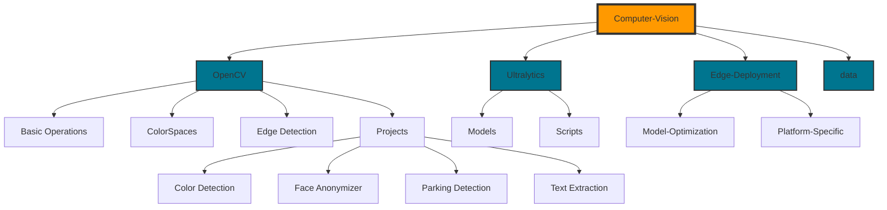
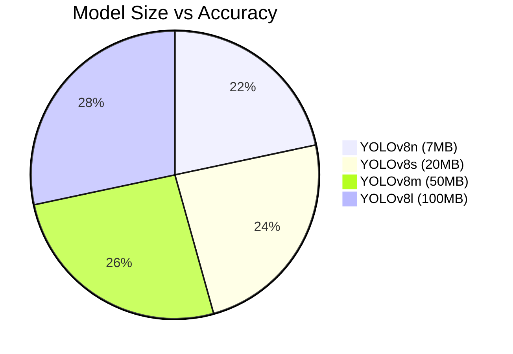

#  Computer Vision Repository

<div align="center">


[](LICENSE)
[](https://www.python.org)
[](https://opencv.org)
[](https://pytorch.org)
[](https://github.com/ultralytics/ultralytics)
[](https://github.com/NayeemHossenJim/Computer-Vision/graphs/commit-activity)

---

<p align="center">
  
  
  
</p>

</div>

> 🚀 A state-of-the-art Computer Vision repository featuring everything from fundamental image processing to cutting-edge deep learning and edge deployment solutions. Built with modern tools and designed for both learning and production use.

<p align="center">
  
</p>

<div align="center">
  
### 🌟 Key Features

[](#fundamentals)
[](#deep-learning-integration)
[](#edge-deployment)
[](#real-time-processing)

</div>

A comprehensive repository that takes you from pixel-level operations to deploying sophisticated computer vision models on edge devices. Perfect for beginners, researchers, and industry professionals.

## 🌟 Features & Contents

### 📚 Fundamentals
- **Image I/O Operations**
  - Image reading/writing
  - Video processing
  - Webcam integration

- **Basic Image Operations**
  - Resizing and scaling
  - Cropping and rotation
  - Pixel manipulation
  - Color space conversions (RGB, HSV, etc.)

- **Image Enhancement**
  - Blurring techniques
  - Thresholding (Global & Adaptive)
  - Edge detection
  - Contour detection and analysis

### 🚀 Projects
- **Color Detection System**
  - Real-time color identification
  - Color tracking and segmentation

- **Face Anonymizer**
  - Face detection
  - Privacy preservation techniques
  - Real-time face blurring

- **Parking Lot Space Detection**
  - Space occupancy detection
  - Vehicle counting
  - Parking management system

- **Text Extraction**
  - OCR implementation
  - Text detection and recognition
  - Document analysis

### 🤖 Deep Learning Integration
- **YOLO Integration**
  - Object detection
  - Instance segmentation
  - Pose estimation

- **Segment Anything Model (SAM)**
  - Auto-annotation
  - Instance segmentation
  - Zero-shot segmentation

### 📱 Edge Deployment
- **Model Optimization**
  - Model quantization
  - Pruning techniques
  - Model compression

- **Edge Platforms Support**
  - Raspberry Pi deployment
  - NVIDIA Jetson support
  - Mobile device deployment
  - Intel NCS2 integration

- **Real-time Processing**
  - Optimization techniques
  - Hardware acceleration
  - Multi-threading implementation

## 🛠️ Installation & Setup

### Prerequisites
```bash
Python 3.8+
CUDA (optional, for GPU acceleration)
OpenCV 4.x
PyTorch
Ultralytics
```

### Environment Setup
```bash
# Create virtual environment
python -m venv venv
source venv/bin/activate  # Linux/Mac
.\venv\Scripts\activate   # Windows

# Install dependencies
pip install -r requirements.txt
```

## 📂 Project Architecture

<div align="center">
  
</div>



> 📌 Each module is designed to be independent yet interconnectable, allowing for maximum flexibility and scalability.

## � Code Examples & Quick Start

<div align="center">
  
</div>

<details>
<summary>🎯 Basic OpenCV Operations</summary>

```python
import cv2
import numpy as np

def process_image(image_path):
    # Read image
    img = cv2.imread(image_path)
    
    # Basic processing pipeline
    gray = cv2.cvtColor(img, cv2.COLOR_BGR2GRAY)
    blur = cv2.GaussianBlur(gray, (5,5), 0)
    edges = cv2.Canny(blur, 100, 200)
    
    # Display results
    cv2.imshow('Original', img)
    cv2.imshow('Processed', edges)
    cv2.waitKey(0)
    
    return edges

# Example usage
process_image('path/to/image.jpg')
```

</details>

<details>
<summary>🤖 Deep Learning with YOLO</summary>

```python
from ultralytics import YOLO
import cv2
import numpy as np

def detect_objects(image_path):
    # Load model
    model = YOLO('yolov8n.pt')
    
    # Perform inference
    results = model(image_path)
    
    # Process results
    for r in results:
        boxes = r.boxes
        for box in boxes:
            # Get box coordinates
            x1, y1, x2, y2 = box.xyxy[0]
            # Get class name
            cls = int(box.cls[0])
            # Get confidence score
            conf = box.conf[0]
            print(f"Detected {model.names[cls]} with confidence {conf:.2f}")
    
    # Show results
    img = cv2.imread(image_path)
    annotated_frame = results[0].plot()
    cv2.imshow("Detection Results", annotated_frame)
    cv2.waitKey(0)

# Example usage
detect_objects('path/to/image.jpg')
```

</details>

<details>
<summary>🎥 Real-time Video Processing</summary>

```python
import cv2
import numpy as np
from ultralytics import YOLO

def process_video_stream():
    # Initialize
    cap = cv2.VideoCapture(0)
    model = YOLO('yolov8n.pt')
    
    while True:
        ret, frame = cap.read()
        if not ret:
            break
            
        # Process frame
        results = model(frame)
        
        # Draw results
        annotated_frame = results[0].plot()
        
        # Display
        cv2.imshow('Real-time Detection', annotated_frame)
        
        # Exit on 'q' press
        if cv2.waitKey(1) & 0xFF == ord('q'):
            break
    
    cap.release()
    cv2.destroyAllWindows()

# Start real-time processing
process_video_stream()
```

</details>

> 💡 These examples demonstrate basic usage. Check individual module documentation for advanced features and customization options.

## 🎯 Development Roadmap

<div align="center">
  
</div>

### Phase 1: Core Enhancement 🚀
- [x] Basic OpenCV implementations
- [x] YOLO integration
- [x] SAM model integration
- [ ] TensorRT optimization
- [ ] Custom hardware acceleration

### Phase 2: Advanced Features 🔬
- [ ] Cloud deployment architecture
- [ ] Real-time streaming pipeline
- [ ] Advanced AR applications
- [ ] 3D vision system
- [ ] Multi-camera support

### Phase 3: Production Ready 💪
- [ ] Automated CI/CD pipeline
- [ ] Comprehensive testing suite
- [ ] Model version control
- [ ] Performance monitoring
- [ ] Production documentation

### Phase 4: Innovation 🌟
- [ ] Custom neural architectures
- [ ] Federated learning support
- [ ] Edge AI optimization
- [ ] Cross-platform deployment
- [ ] Real-time 3D reconstruction

## 📊 Performance Metrics

<div align="center">

### Inference Speed (FPS)
| Model | CPU | GPU | Edge Device |
|-------|-----|-----|-------------|
| YOLOv8n | 25 | 120 | 15 |
| YOLOv8s | 20 | 100 | 12 |
| SAM | 10 | 45 | 5 |

### Model Size vs Accuracy


</div>

> 📈 Benchmarks are continuously updated as new optimizations and models are implemented

## 🤝 Contributing
Contributions are welcome! Please read our [Contributing Guidelines](CONTRIBUTING.md) for details on how to submit pull requests, report issues, and contribute to the project.

## 📝 License
This project is licensed under the terms of the [MIT License](LICENSE).

## 🤝 Community & Support

<div align="center">
  
</div>

<div align="center">
  
[](https://github.com/NayeemHossenJim/Computer-Vision/issues)
[](https://github.com/NayeemHossenJim/Computer-Vision/stargazers)
[](https://github.com/NayeemHossenJim/Computer-Vision/fork)

</div>

### � Get in Touch

<div align="center">
  
[](https://www.linkedin.com/)
[](https://twitter.com/)
[](https://github.com/NayeemHossenJim)

</div>

## 🌟 Contributors

Thanks to these wonderful people:

<div align="center">
  <a href="https://github.com/NayeemHossenJim/Computer-Vision/graphs/contributors">
    
  </a>
</div>

## 🙏 Acknowledgments

<div align="center">
  
[](https://opencv.org)
[](https://ultralytics.com)
[](https://pytorch.org)

</div>

Special thanks to all contributors and the open-source community for making this project possible!

---

<div align="center">
  
</div>

<div align="center">
  <i>Built with ❤️ by the Computer Vision Community</i>
</div>
